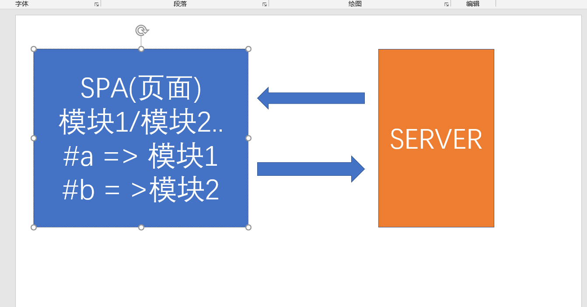
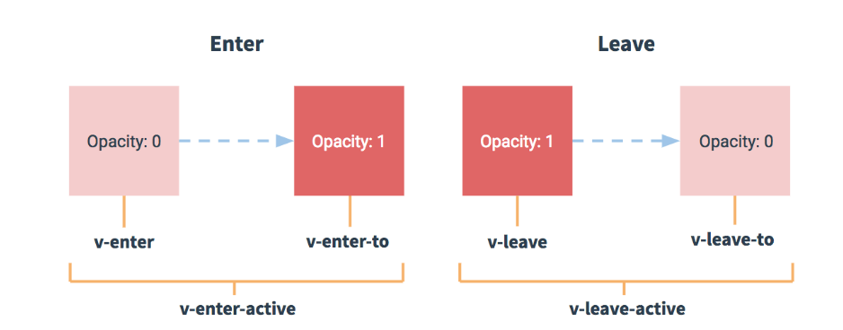
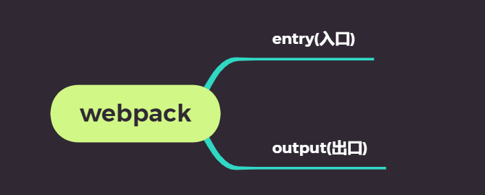
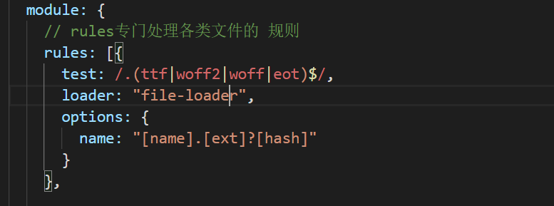

## 基础-单页应用-SPA的特点

**`目标`**  掌握SPA的特点 single  page  application

MPA  多页面应用

SPA  单页面应用  

传统模式(MPA) 每个页面及其内容都需要从服务器一次次请求  如果网络差, 体验则会感觉很慢

spa模式, **`第一次`**加载 会将所有的资源都请求到页面 **`模块之间切换`**不会再请求服务器

**`SPA优点`**

1. 用户体验好,因为前段操作几乎感受不到网络的延迟
2. 完全组件化开发 ,由于只有一个页面,所以原来属于一个个页面的工作被归类为一个个**`组件`**.

**`缺点`**

****

Vuejs/Reactjs/Angularjs  都是客户端渲染, 也就是先请求js,然后js在前端动态渲染结构

****

1. **`首屏`**加载慢->**`按需加载`** 不刷新页面 只请求js模块
2. 不利于SEO->**`服务端渲染`**  =>  vue 进阶 (服务端渲染) =>nuxt =>vuejs  React =next.js
3. **`开发难度高`**(框架) 相对于传统模式,有一些学习成本和应用成本


## 基础-单页应用-SPA-实现原理及前端实现

**`目标`** 掌握前段SPA的实现原理

* SPA要实现 能够在**`前端自由切换模块`** 
* SPA要能记忆当前切换的模块,并且刷新页面模块依然还在当前视图
* SPA要实现在前端切换模块时,不能引起页面刷新,否则页面内容会被重置

 **`结论`**

 * 可以通过页面地址的**`锚链接`**来实现spa
 * hash(锚链接)位于链接地址 **`#`**之后
 * hash值的改变**`不会触发`**页面刷新
 * hash值是url地址的一部分,会存储在页面地址上 我们可以获取到 通过**`location`**
 * 可以通过**`事件监听`**hash值得改变
 * 拿到了hash值,就可以根据不同的hash值进行不同的**`模块切换`**

> 通过上面,我们发现了 实现前端路由的方式 , 尝试用上面所提到的技术实现一个前端路由吧



**`任务`**    

用锚链接实现前端路由

1. 西游记 / 水浒传 / 红楼梦 / 三国演义  四个 导航分别指向 四个人物
2. 点击对应的名著, 出现对应的人物
3. 刷新页面, 上一次所切换的人物还在 


## 基础-路由-vue-router-介绍及使用

**`目标`**  了解vue-router是什么并且根据体验步骤使用vue-router

>  Vue-Router 是 [Vue.js](http://cn.vuejs.org/) 官方的路由管理器。它和 Vue.js 的核心深度集成，让构建**`单页面`**应用变得易如反掌 

vue-router实际上就是根据不同的**`请求地址`** 而**`显示不同的组件`**

> 使用步骤

1. 引入vue和vue-router
2. 设置导航和 容器 , 导航我们采用的 router-link组件 ,容器我们采用的router-view组件

```vue
<!-- router-link 最终会被渲染成a标签，to指定路由的跳转地址 -->
<router-link to="/users">用户管理</router-link>

<!-- 路由匹配到的组件将渲染在这里 -->
<router-view></router-view>
```

> router-link中的to属性表示点击该导航要跳到哪个路由, 一般的路由地址以/开头
>
> router-view 是用来承载 要显示在页面的组件的, 容器是必须有的

3. 实例化路由对象

```js
new  VueRouter()
```

> 路由对象也需要实例化

4. 配置路由对象的实例选项, **`routes`**,也就是**`路由规则表`**

```js
// 配置路由规则
var router = new VueRouter({
routes: [
{ name: 'home', path: '/', component: Home },
{ name: 'users', path: '/users', component: Users }
]
});
```

> routes是一个数组, 数组里每一条记录代表一个路由规则
>
> path: 地址(一般以/开头)  component: 组件对象() name : 规则名称

5. 将路由对象挂载Vue实例上

```js
var vm = new Vue({
el: '#app',
router
});
```

**`任务`**

* 尝试用vue-router实现  古代四大美女 的路由 匹配四个美女的组件

## 安装DevTools的Vue调试工具

> vue-devtools是一款基于chrome浏览器的插件，用于调试vue应用，这可以极大地提高我们的调试效率。接下来我们就介绍一下vue-devtools的安装。

谷歌游览器输入地址“**`chrome://extensions/`**”进入扩展程序页面，点击“加载已解压的扩展程序...”按钮，选择vue-devtools下的文件。

git中提供了 **`devtools`**  的压缩包,直接加载即可

> 然后, 在调试中就可以看到Vue的调试节点.可以通过组件的节点 查看组件的 **`data/props/computed`**

## 基础-路由-vue-router-动态路由传参 和 query传参

**`目标`** 掌握 Vue-router中路由的传参方式

我们经常遇到这种场景, 从**`列表页`** 跳转到 **`详情页`**

这种情况下 ,需要把点击列表项的id传到 详情页, 怎么做呢? 

> Vue-Router提供了两种方式

* **`第一种`**: 动态路由传参

1. (**`接收参数的`**)路由规则中增加参数，在path最后增加 **:id**, (id是可以随意命名的)

```json
{ name: 'users', path: '/users/:id', component: Users },
```

2. 通过 <router-link> 传参，在路径上传入具体的值

```html
<router-link to="/users/120">用户管理</router-link>
```

3. 在组件内部可以使用，**`this.$route`** 对象的**`params`**获取该参数

```js
var Users = {
    template: '<div>这是用户管理内容 {{ $route.params.id }}</div>',
    created() {
        console.log(this.$route.params.id);
    }
};
```

> 需要注意的是, 如果我们在上面的地址上 写了 /users, 匹配不到任何组件, 因为/users没有传参数, 如果我们想要**`/users/:id`**  能够匹配 **`/users`** ,我们应该 这么写路由规则

```json
{ name: 'users', path: '/users/:id?', component: Users },
```

> **`/users/:id?`**这么写表示, 不传id参数也可以匹配 组件

* **`第二种`** 查询参数query传参

除了通过 第一种形式传参, 我们还可以通过 在地址后面 **`? 名称=值`**的方式 进行传参, 如果有多个,可以**`用 &分割`**

1. 传递参数

```vue
<router-link to="/users?id=123" />
```

2. 获取参数, 我们可以通过 **`this.$route`**对象的**`query`**获取该参数

```js
var Users = {
    template: '<div>这是用户管理内容 {{ $route.query.id }}</div>',
    created() {
        console.log(this.$route.query.id);
    }
};
```

**`任务`**

 定义一个路由, 导航为 **`bkList`**(百科列表)和 **`bkInfo`**(百度详情)

点击百科列表中 **`明星`** 跳到 **`明星详情`**, 传入一个id

**`明星详情`** 根据传入的id 显示对应的 明星照片

## 基础-路由-to多种方式 和 路由重定向

**`目标`**掌握 vue-router中的to的多种赋值方式  和 路由的重定向

* to属性 有多种赋值方式  

> 可以直接是一个地址

```html
<router-link to="/sport">体育</router-link>
```

> 可以是一个对象,对象中可以是 path 地址 或者 name

```html
<router-link :to="{path:'/sport'}">体育</router-link>
```

```html
<router-link :to="{name:'abc'}">体育</router-link>
```

> 当选中某个导航之后, 可以通过激活class分别出 谁是的当前的**`激活导航`**

* 当我们选中了某个导航,可以通过激活class分别出 

```vue
	<a href="#/news" class="router-link-exact-active router-link-active">新闻</a>
```

>  审查导航元素,可以发现 激活样式

* 当希望某个页面被强制中转时  可采用**`redirect`** 进行**`路由重定向`**设置   

=>  A页面 (拦截请求) =>强制中转B页面, 只需要在A页面的路由位置 写一个redirect属性

```json
{
 path: "/sport",
 redirect: "/news", // 强制跳转新闻页
  component: {
   template: `<div>体育</div>`
   }
},
```

## 基础-路由-vue-router-编程式导航

**`目标`**掌握路由-vue-router-编程式导航

>  跳转不同的组件 不仅仅可以用router-link 还可以采用**`代码行为`**

**`this.$router`** 可以拿到当前路由对象的实例

路由对象的实例方法 有 **`push`**  **`replace`**, `go`()  `back`()

* push 方法 相当于往历史记录里**`增加`**了一条记录 如果点击返回 会回到上一次的地址
* replace方法 想相当于**`替换`**了当前的记录  历史记录并没有多 但是地址会变
* go(数字) 代表希望是前进还是回退,当数字大于0 时 就是前进 n(数字)次,小于0时,就是后退n(数字)次
* back 表示**`回到上一个`**页面

push

```js
this.$router.push(参数)  // 参数 1. 字符串(地址) 2. 对象 { path } / {name}
```

replace

```js
this.$router.replace(参数)  // 参数 1. 字符串(地址) 2. 对象 { path } / {name}
```

go

```js
this.$router.go(-1) // 后退1次
this.$router.go(2)  // 前进两步
```

back

```js
this.$router.back() // 回到上一个页面 相当于 go(-1)
```


**`任务`**

用编程式导航实现

1. 实例化路由,定义四个组件  北京/上海/ 深圳/广州
2. 北京跳到上海, 上海可以返回到北京
3. 上海跳到深圳, 深圳不能返回上海
4. 上海到广州, 广州可以**`直接`**到北京 


## 基础-路由-vue-router-嵌套路由

**`目标`** 掌握如何实现一个嵌套路由

 我们会遇到这样一种场景, 在一级导航下,存在二级导航,比如 北京市下面还有 各个区县

这个时候,实际上就是需要做路由的嵌套

> 如果存在**`路由嵌套`**,就需要提供多个视图容器**`<router-view></router-view>`**

意思是:  你的一级导航对应的组件 需要 一级路由容器

​               你的二级导航对应的组件 需要二级路由容器

​               你的三级路由导航组件  需要三级路由容器

​                ...

> **`二级路由容器 需要写在一级路由的组件里面`**

> 二级路由的路由表 需要配置在一级路由的路由表的 **`children`** 下

   **`任务`** 

1. 实现一个嵌套路由   
2. 第一级路由  **`主食`** /  副食 / 饮料
3. 在主食组件下 建立二级路由 /  列出几种美食 


嵌套路由要素

1.**`二级路由容器 需要写在一级路由的组件里面`**

2.二级路由的路由表 需要配置在一级路由的路由表的 **`children`** 下

  **要注意，`以 / 开头的嵌套路径会被当作根路径`。**

## Vue中的动画过渡

>**`目标`**掌握如何在Vuejs中实现动画过渡
>
>Vue 提供了 `transition` 的封装组件，在下列情形中，可以给任何元素和组件添加进入/离开过渡
>
>- 条件渲染 (使用 `v-if`)
>- 条件展示 (使用 `v-show`)
>- 动态组件
>- 组件根节点
>
>* 基本用法就是给我们需要动画的标签外面包裹**`transition`**标签 ,并且设置name属性
>* Vue 提供了 `transition` 的封装组件，在下列元素更新,移除，新增 情形中，可以给任何元素和组件添加进入/离开过渡
>* 
>
>```html
><transition name="fade"> 
>  <div v-show="isShow" class="box"></div>
></transition>
>```
>
>6中class状态 
>
>1. v-enter：定义进入过渡的开始状态。
>2. v-enter-active：定义进入过渡生效时的状态。
>3. v-enter-to: 2.1.8版及以上 定义进入过渡的结束状态。
>4. v-leave: 定义离开过渡的开始状态。
>5. v-leave-active：定义离开过渡生效时的状态。
>6. v-leave-to: 2.1.8版及以上 定义离开过渡的结束状态。
>
>

**`注意`**  **`v`**要替换成transition组件的name属性值

**`注意`**先要编写元素的最终展示样式

**`任务`**

1. 实现一个div 显示时 从小到大过渡
2. 实现该div隐藏时 从大到小

## 基础-vue-cli安装和2-3-4版本解释

前端的工程化 => 导致环境 管理 需要加强

**`目标`**掌握vue-cli的版本安装

**`vue-cli`**是一个**`辅助开发工具`**=> **`代码编译`** + **`样式`** + 语法校验 + 输出设置 + 其他 ...

可以为开发者提供一个**`标准的项目开发结构`** 和配置  **`开发者`**不需要再关注

vue-cli 是一个**`命令行`**工具,本质上是一个**`npm`**包,也需要通过npm去安装下载

```bash 
$ npm i -g @vue/cli  # 全局安装脚手架  默认安装的最新版本 4.0+
```

安装完成后  可通过 **`vue命令`**来进行检查 脚手架是否安装成功

查看版本

```bash
$ vue -V  # 查看脚手架版本号  注意是大写V哦
```

默认安装的 4.0+ 版本,但是企业很多还在用2.0+版本 怎么破?

执行以下命令就可以 2.0 和 4.0 兼得

```bash
$ npm install -g @vue/cli-init  # 安装桥接工具 将2.0的功能补齐到目前的脚手架上
```

> Vue创建的项目并不是单一的, 有简单的结构,也有复杂的结构.

**`任务`**

1. 安装vue-cli脚手架 并 将2.0版本的补丁安装到当前版本

## 基础-vue-cli创建项目

**`目标`** 学会使用vue-cli 2.0特性创建项目

创建项目: 采用 vue-cli 2.0的特性 (生成简易模板)

```bash
#  heroes 创建的项目名称
$ vue  init webpack-simple heroes //  webpack-simple 为模板名称 固定写法
# 切换到当前目录
$ cd  heroes 
# 安装依赖
$ npm install  
# 在开发模式下 启动运行项目
$ npm run dev

```


创建项目: 采用 vue-cli 4.0 特性 (两种默认/选填)


```bash 
# 4.0下创建项目
$ vue create heroes // create(创建) 为关键字
# 切换到当前目录
$ cd  heroes 
# 在开发模式下 启动运行项目
$ npm run serve
```

4.0 +创建项目时  有两种模式, 一种**`默认模式`**, 一种**`选择模式`**,

默认模式:一种标准的模板

选择模式 可以根据自己的需求选择需要的工具和模式

**`任务`**

1. 分别使用vue-cli 2.0 和 4.0特性创建一个叫做heroes的项目 
2. 分别启动运行

## 基础-vue-cli项目目录解释

**`目标 `**对2.0项目目录生成的模板文件进行识别认识

> src 目录 是整个项目的源代码目录,所有的代码都写在src里面

>  .bablelrc=>存放 babel编译的配置信息  专门处理ES6转化成ES5的代码

> .editorconfig 帮助开发人员定义和维护一致的编码风格在不同的编辑器和IDE

> .gitignore 是配置git的忽略文件, 也就是你不希望被git追踪的文件都在这里 例如 node_modules

> index.html 我们所做的spa页面, index就是最终呈现的页面

> package.json 用于存放依赖信息 和其他项目信息

> README.md 项目的一些介绍信息

> webpack.config.js  一个打包工具 webpack的配置的文件,  webpack是一个前端工程化的工具  编译代码 -压缩代码- 处理代码,其他....


## 脚手架的运行模式介绍

**`目标`** 介绍脚手架的开发和运行模式

> 我们用脚手架 可以 轻而易举的启动一个项目, 这是怎么实现的 ? 

实际上,我们的脚手架是一个前后端的项目, 我们的 **`npm  run dev`** 实际上就是启动了这个项目服务, 开启一个默认的端口(**`8080`**)

> 运行的代码就是src里的代码吗? 

**`是!  也不是!`**  

什么意思呢 ? 实际上, **`npm run dev`** 运行的代码 是 **`src目录`**  的代码 **`编译之后`**的代码, 一旦我们修改了src下的代码,  此时 就会**`重新编译`**, 页面**`重新刷新`**, 

> 这是谁帮我们做的 ? 

**`webpack`**  , 是这个打包工具帮我们完成了 编译代码, 启动服务 等一系列的操作

我们可以通过 webpack.config.js 进行查看




上面的**`entry`**  表示 webpack 要编译文件的入口

**`output`**表示webpack 编译出来的文件输出的文件名及位置

> 我们发现, entry对应的是 src下的 main.js文件,  输出文件是 dist下的build.js

而且实际上,我们的单页应用 index.html 就是 引用了 build.js文件, 所以这也就是解释了 咱们一开始 的 

**`是!也不是!`**

>  而且, 你们可能会感觉疑惑, 并没有dist的物理目录啊? 为什么还可以访问?  

因为 webpack 可以实现**`热更新`**, 也就是改动src代码之后, 页面立刻变化, 所以为了提升效率,  webpack在**`dev`**的时候并不会生成**`物理文件`**, 而是将编译出的代码 用内存流的形式 输出到了前端, 这样做的目的是 为了提升开发和调试的效率 ,我们**`无须过多关注`**

我们在看 入口文件 **`main.js`**的时候  发现了一些新的语法  

```js
import Vue from 'vue'
import App from './App.vue'

new Vue({
  el: '#app',
  render: h => h(App)
})

```

import   from 

我们在下一节进行介绍

## 基础-回顾-ES6模块的导入和导出

**`目标`**   学习前端ES6的导入和导出

我们之前学习过 Commonjs 的导入和 导出, 也就是nodejs的导入和导出

Commonjs导入

```js
require('地址')  // 引入一个对象
```

Commonjs 导出

```js
module.exports = {} // 导出一个对象
```

> es6 新推出了 关于 导入导出的一种新方式, 在es6中一个文件可以默认为一个模块，模块通过**`export`**向外暴露接口，实现模块间交互等功能

* **`export default`**

```js
//一个文件即模块中只能存在一个export default语句，导出一个当前模块的默认对外接口
export default {}  // 导出一个对象
```

* **`import`**

```js
import  Example from '地址' // 可以引入一个export default的对象 如果是第三方包 可以只写包名
```

> 除了 导出一个**`默认对象`**外, export 还可以导出若干**`平常`**对象

```js
export const function  fn1() {} // 方法1
export const function  fn2() {} // 方法2
export const function  fn3() {} // 方法3
```

> 引用方式 则采用

```js 
import { fn1,fn2, fn3 } from '文件'
```

## 基础-入口解析及单文件组件

**`目标`**  掌握认识 入口文件 Vue的单文件组件

> 在文件入口**`main.js`** , 我们遇到了这样的代码

```js
import Vue from 'vue' 
import App from './App.vue'

new Vue({
  el: '#app',
  render: h => h(App)
})

```

> 上面 有两个东西 我们没有见过,   一个是**`.vue`**文件 , 一个是 **`new Vue()`**中的render

首先,我们认为一个**`.vue`**文件就是一个组件, 也就是**`单文件组件`**

然后,**`render`** 实际上就是 将 **`App.vue`**组件 渲染到了我们的**`el`**所对应的视图上, 它会**`替换`**el所对应的视图

所以,我们将App.vue组件 认为是整个项目的**`根组件`**, 我们开发的所有组件 或者路由都应该在 **`根组件`**的基础之上

```js
// main.js 作为整个项目的入口
// 入口 实例化了一个Vue实例
// Vue实例通过 render方法 将App.vue组件渲染到了页面上
// App.vue组件作为整个项目的根组件存在
// 以后开发项目 需要在根组件的基础之上去开发
// main.js是入口
// App.vue是根组件
```

****

> 单文件组件有什么特点

一个单文件组件 应该有这样几个要素

* **`template`**  就是 原来写组件的时候, 写的template属性,只不过被提出来 形成了一个单独的节点,写结构更加方便,有提示,效率更高 ,  **`有且只有一个根节点`**
* **`style`**  就是针对当前组件的样式表 可以写less /sass 等其他预处理器
* **`script`**  就是 除去template属性之外的所有组件属性和选项, **`需要导出`**一个组件对象,这样别人才能引用

> template的内容实际上 就是原有的组件的template,重新提升了一个节点, 方便我们有提示的进行开发.

```vue
<template>
   <div>内容</div>
</template>
<script>
  export default {}
</script>
<style>
</style>
```

> 当我们需要在一个组件中 使用另一个组件时,  首先要确定该组件 已经**`注册`**

注册的意思是:  要么该组件已经**`全局注册`**, 要么该组件**`局部注册`**在当前组件实例上

> 怎么注册呢? 

要通过 **`import`**   **`from`** 的方式 先把组件引过来, 然后 完成全局或者局部注册

**`任务`**  开发一个 商品列表  produce-list  组件


## 基础-示例项目效果演示及导入素材及样式

**`目标-任务`**:将项目所需样式导入到项目中 

* 安装 bootstrap固定版本

```bash 
npm i  bootstrap@3.3.7
```

安装完成之后 ,在入口处引入css文件

```js
import "./../node_modules/bootstrap/dist/css/bootstrap.css"; // 引入 bootstarp的样式文件
import "./assets/index.css"; // 引入index.css

```

重启运行,发现bootstrap.css文件 运行报错 

根据错误 需要在webpack.config.js增加对**`不识别文件`**的处理

```js	
{
 test: /.(ttf|woff2|woff|eot)$/,
 loader: "file-loader",
 options: {
   name: "[name].[ext]?[hash]"
 }
}
```

将上述的配置文件 加入到webpack.config中即可



## 基础-示例项目-提取公共组件-头部-侧边栏-列表,并预览效果

**`目标-任务`**:将静态内容的 头部 侧边栏 , 列表分别封装成Vue组件 ,并在视图中显示

**`路径`** 提取组件

1. 新建vue文件
2. 拷贝html静态内容到 template中
3. 在app.vue中引入注册组件
4. 注册在app.vue的组件中 
5. 在app.vue的模板中使用注册组件 

```vue
<template>
  <div id="app">
    <!-- 头部组件 -->
    <app-header></app-header>
    <div class="container-fluid">
      <div class="row">
        <!-- 侧边栏 -->
        <app-sidebar></app-sidebar>
        <!-- 英雄列表组件 -->
        <app-list></app-list>
      </div>
    </div>
  </div>
</template>

<script>
import appHeader from "./app-header"; // 引入头部组件
import appSideBar from "./app-sidebar"; //引入侧边栏组件
import appList from "./app-list"; // 引入英雄列表组件
export default {
  name: "app",
  components: {
    "app-header": appHeader, // 完成组件注册
    "app-sidebar": appSideBar, // 完成侧边栏组件的注册
    "app-list": appList // 完成对英雄列表的注册
  }
};
</script>

<style>
</style>

```


## 基础-示例项目-提取路由模块

**`目标-任务`** 在示例项目中 提取路由模块,并应用视图

1  安装路由 

```bash 
npm i vue-router // 安装路由模块
```

2   在main.js中引入 路由模块

```js
import VueRouter from 'vue-router ' // 引用router
```

3  使用router 

```js 
Vue.use(VueRouter) // 使用router  => 全局注册vue-router对象
```

4   实例化 router 

```js 
const router = new VueRouter({
routes:[] //实例化routes
})
```

5  配置理由表

```js
//  专门放置路由的
// 为什么要把文件命名index ?
// import test from './router'  如果 router是一个文件夹的话 
// import test from './router' 相当于 获取 import test from './router/index.js'文件
// import test from './router'  等价于 import test from './router/index' 
import Vue from 'vue'
import VueRouter from 'vue-router'  // 引用路由对象
import HeroList from '../views/heroes/hero-list'  // 单文件组件
import weaponList from '../views/weapon/weapon-list'  // 单文件组件
import GearList from '../views/gear/gear-list'  // 单文件组件

Vue.use(VueRouter) // 全局注册

const router = new VueRouter({
    // 配置路由表
    //  一般挂在路由上的组件 叫做 路由级组件
    // 路由级组件一般放置在src/views目录
    // views又可以新建文件夹 或者文件
    routes: [{
        path: '/heroes', // 定义路径 是自己定义的
        component: HeroList
    }, {
        path: '/weapon',
        component: weaponList  // 武器组件
    }, {
        path: '/gear',
        component: GearList // 装备组件
    }]
})

export default router // 导出一个变量
```
**注意** 一般来说 路由表 需要单独一个文件   可以将router提取成一个js文件 

6   提取 三个组件 hero-list(英雄列表)  weapon-list(武器列表) gearList(装备列表) 完善路由表

7   在App.vue中路由承载视图**`router-view`**

```html
<div>
<AppHeader></AppHeader>
<div class="row">
<AppSilder></AppSilder>
<div class="col-sm-9 col-sm-offset-3 col-md-10 col-md-offset-2 main">
<router-view></router-view> // 加入承载视图
</div>
</div>
 </div>
```

8. router--link默认生成的就是a标签,**`但是`**我们可以改变router-link最终生成的标签

> router-link  有一个属性 叫做 tag, 可以通过设置tag来改变 默认生成的标签 tag的值默认为**`a`**

```vue
<template>
  <!-- 侧边栏导航组件 -->
  <div class="col-sm-3 col-md-2 sidebar">
    <ul class="nav nav-sidebar">
      <!-- vuejs 中  tag属性可以改变 router-link中的生成默认标签-->
      <router-link tag="li" to="/heroes">
        <a href="#">英雄列表</a>
      </router-link>
      <router-link tag="li" to="/gear">
        <a href="#">装备列表</a>
      </router-link>
      <router-link tag="li" to="/weapon">
        <a href="#">武器列表</a>
      </router-link>
    </ul>
  </div>
</template>

<script>
export default {};
</script>

<style>
</style>
```


## 基础-示例项目-json-server-启动接口服务器

**`目标-任务`**准备json-server服务器.启动实现 数据接口 增删改查的联通

**`路径`**: 启动json-server服务器

1  安装json-server  

**注意** json-server 是一个命令行工具,和vue以及vue-cli没有任何关系 所以安装在任何位置都可以

```bash 
npm i -g json-server // 安装json-server 
```

2  新建json文件 

```json
{
"heroes": [
{ "name": "张三", "id": 1, "gender": "男" },
{ "name": "李白", "id": 2, "gender": "女" },
{ "name": "吕布", "id": 3, "gender": "男" }
]
}

```

3  启动json-server

```bash
json-server --watch db.json 
```

如果想 改变端口

```bash
$  json-server -w -p  3002 db.json #以特定的端口号启动命令
```

## 基础-示例项目-列表渲染

**`目标-任务`**完成英雄列表的数据加载及渲染

>**`路径`**:
>
>1 安装 axios 插件 
>
>```bash
>$ npm i axios #安装axios插件
>```
>
>2  英雄列表组件中引入 axios , 
>
>```js 
>import axiod from 'axios' // 引入axios
>```
>
>3  定义数据list
>
>```js
> data() {
>    return {
>      // 响应式数据
>      list: [] // 接收英雄列表的数据
>    }; // 因为组件数据是独立的
>  }
>```
>
>4  请求英雄列表的方法封装 
>
>```js
>    //  定义方法
>    loadData() {
>      axios.get("http://localhost:3001/heroes").then(result => {
>        // 拿到了result数据 赋值给 list axios封装了一层数据 我们应该取data
>        this.list = result.data;
>      });
>    }
>```
>
>5  在事件中加入 请求方法
>
>```js
>  created() {
>    // 实例创建完成事件
>    this.loadData(); // 获取列表数据
>  }
>```
>
>6  渲染列表list

## 基础-示例项目-删除功能

**`目标`**实现英雄列表的删除功能

>1  注册删除事件 
>
>```html
><a href="#" @click.prevent="delItem(item.id)">删除</a>
>```
>
>2 定义删除方法  实现删除逻辑
>
>```js
>    delItem(id) {
>      // 友好的提示一下
>      if (confirm("您是否要删除此条数据啊?")) {
>        // 调用删除接口
>        axios.delete(`http://localhost:3001/heroes/${id}`).then(() => {
>          // 如果删除成功了 会进入到then方法中
>              this.loadData(); //重新拉取数据
>        });
>      }
>```
>
>  3  根据状态 进行刷新页面
>  
>```js
>this.loadData(); // 刷新数据
>```
>
>

## 基础-示例项目-添加和编辑组件

**`目标-任务`**添加组件功能的静态实现

>1 新建add-edit.vue组件 并写入静态内容
>
>```html
>  <div>
>    <h2 class="sub-header">添加英雄</h2>
>    <form>
>      <div class="form-group">
>        <label for="exampleInputEmail1">姓名</label>
>        <input type="text" class="form-control" id="exampleInputEmail1" placeholder="请输入您的姓名" />
>      </div>
>      <div class="form-group">
>        <label for="exampleInputPassword1">性别</label>
>        <input type="text" class="form-control" id="exampleInputPassword1" placeholder="请输入您的性别" />
>      </div>
>      <button class="btn btn-success">添加英雄</button>
>    </form>
>  </div>
>```
>
>2  在路由表中配置添加功能的路由
>
>```js
>{ path: "/add-edit", component: AddEdit}  // 引入组件 配置路由
>```
>
>3  给列表组件中的添加按钮 添加l导航 到添加功能路由的导航
>
>```html
><!-- 给添加功能添加路由导航 -->
><router-link class="btn btn-success" to="/add-edit">添加</router-link>
>```
>
>4  根据业务场景调整页面模板
>
>```html
>  <div>
>    <h2 class="sub-header">添加英雄</h2>
>    <form>
>      <div class="form-group">
>        <label for="exampleInputEmail1">姓名</label>
>        <input type="text" class="form-control" id="exampleInputEmail1" placeholder="请输入您的姓名" />
>      </div>
>      <div class="form-group">
>        <label for="exampleInputPassword1">性别</label>
>        <input type="text" class="form-control" id="exampleInputPassword1" placeholder="请输入您的性别" />
>      </div>
>      <button class="btn btn-success">添加英雄</button>
>    </form>
>  </div>
>```
>

## 基础-示例项目-添加-功能实现

**`目标-任务`** 实现添加英雄的功能

>1  定义表单数据  和  表单进行绑定 
>
>```js
>data() {
>return {
>// 定义一个数据对象 存储 姓名和性别
>formData: {
>name: "", // 姓名
>gender: "" // 性别
>}
>};
>}  //定义一个数据对象
>```
>
>2 	注册添加按钮的点击事件 
>
>```html
><!-- 给添加英雄按钮注册一个事件 -->
>      <button @click.prevent="saveHero" class="btn btn-success">添加英雄</button>
>
>```
>
>3   实现 添加的前后逻辑
>
>```js
>    // 定义保存英雄方法
>    saveHero() {
>      // 首先应该判断 姓名和性别不能为空啊
>      if (this.formData.name && this.formData.gender) {
>        //  都存在才能保存
>        // 调用新增接口 restful => get /put /post /delete
>        axios.post("http://localhost:3001/heroes", this.formData).then(() => {
>          // 一旦进入then 说明新增成功了
>          // 回到列表页
>          //
>          this.$router.push("/heroes"); // 回到列表页
>        });
>      } else {
>        alert("兄嘚,得填全啊");
>      }
>    }
>```
>
>

## 基础-示例项目-编辑-功能实现

**`目标-任务`**实现英雄列表的编辑功能组件渲染

1. 添加-编辑组件路由支持传参

```json
{ path: "/add-edit/:id?", component: AddEdit }  // 引入组件 配置路由
```

2. 编辑按钮添加跳转路由的属性

```html
  <router-link :to="`/add-edit/${item.id}`">编辑</router-link>
```

3. 定义加载英雄方法  通过 $router.params来获取参数

```js
    // 加载对应的英雄
    loadHero() {
      if (this.$route.params.id) {
        // 如果id存在 表示 当前有id  表示当前是修改状态
        axios
          .get(`http://localhost:3001/heroes/${this.$route.params.id}`)
          .then(result => {
            //   获取到对应英雄的数据
            this.formData = result.data; // 将数据赋值给formData
          });
      }
    }
```

4. 在初始化事件中 调用loadHero 方法

```js
// 实例完成事件
created() {
  this.loadHero(); // 加载英雄
}
```

5. 保存时 进行判断 是新增还是 编辑

   ```js
   saveHero() {
         // 首先应该判断 姓名和性别不能为空啊
         if (this.formData.name && this.formData.gender) {
           //  都存在才能保存
           // 调用新增接口 restful => get /put /post /delete
           if (this.$route.params.id) {
             // 应该调用 编辑接口
             axios
               .put(
                 `http://localhost:3001/heroes/${this.$route.params.id}`,
                 this.formData
               )
               .then(() => {
                 // 一旦成功了 说明编辑成功了  回到列表页
                 this.$router.push("/heroes"); // 回到列表页
               });
           } else {
             // 应该调用新增接口
             axios.post("http://localhost:3001/heroes", this.formData).then(() => {
               // 一旦进入then 说明新增成功了
               // 回到列表页
               //
               this.$router.push("/heroes"); // 回到列表页
             });
           }
         } else {
           alert("兄嘚,得填全啊");
         }
       },
   ```

## 基础-  示例项目-优化-axios统一导入和设置baseURL

**`目标-任务  `**实现axios的统一导入

1. 在入口main.js文件中引入axios,并给全局Vue对象的原型属性赋值 

 ```js
Vue.prototype.$axios = axios; //所有的实例都直接共享拥有了 这个方法
 ```

> 设置完成后,在组件的任意位置就可以通过 **`this.$axios`** 获取axios对象 并进行对象请求

2. 我们可以统一设置axios的**`请求头`**地址 baseURL

   ```js
   axios.defaults.baseURL = "http://localhost:3000"; // 设置共享的方法
   ```

   >上面改完之后,我们就不再需要写常常的地址啦

3. 统一给router-link设置激活样式

```js
linkActiveClass: "active", // active为bootstrap中的 一个class样式
```

> 激活样式在router实例化选项上配置

## 给切换路由增加过渡效果 (扩展)

**`目标-任务`**实现项目中的路由切换过渡

1. 用过渡组件包裹路由视图

   ```vue
   <transition name="slide">
     <router-view></router-view>
   </transition>
   ```

2. 编写 过渡效果

   ```css
   /* 2.编写 动画样式 */
   .v-enter {
     /* 进入时 是透明 */
     opacity: 0;
   }
   .v-enter-active {
     /* 写过渡 */
     transition: all 0.5s;
   }
   ```

>对router-view的动画 写一个进入 或者离开就可以 

为什么?

> 因为router-view 切换组件 是一个组件进入 , 一个组件离开, 会有两个组件同时动画

如果你有多个动画, 你需要给transition一个name名称, 因为如果都给name,那么大家的动作样式都是

.v-enter/ .v-enter-acitve 

样式就会重复

## 生命周期-钩子函数

>**`目标`**掌握Vue的生命周期及其**`钩子函数`**
>
>* 生命周期是指Vue实例或者组件从诞生到消亡经历的每一个阶段，在这些阶段的前后可以设置一些函数当做事件来调用。
>
>

* beforeCreate (实例被创建前)
* created(实例被创建后)
* beforeMount(文档被挂载前)
* mounted(文档被挂载后)
* beforeUpdate(数据变化 页面更新前)
* updated(数据变化 页面更新后)
* beforeDestory(视图销毁前)
* destoryed(视图销毁后)

**`任务`**

1. 分别在以上不同的生命周期中 输出不同内容 查看不同变化

