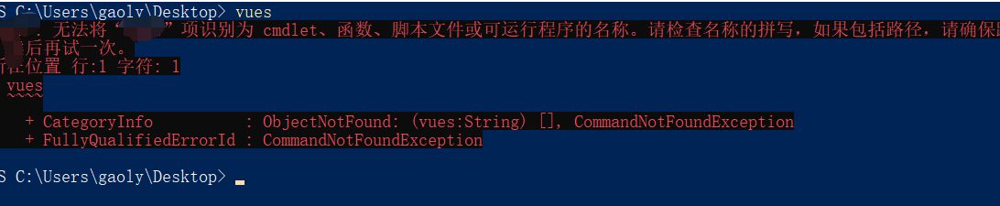
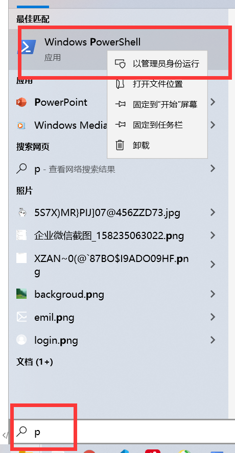
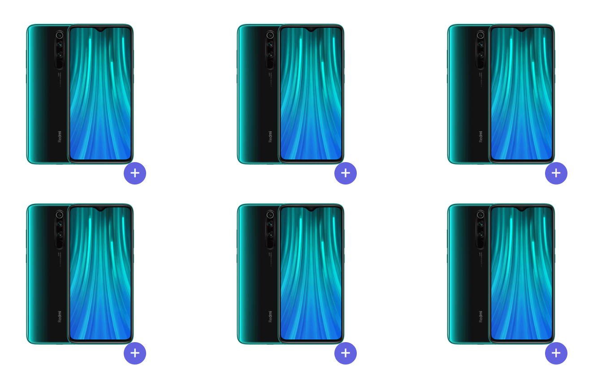
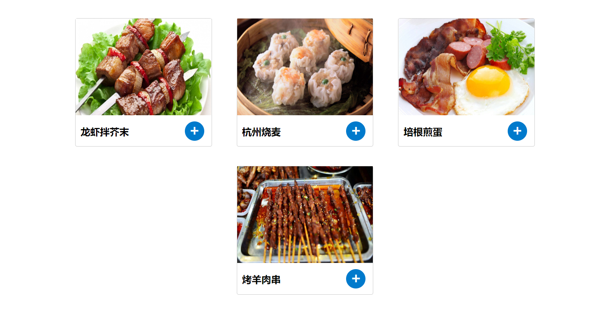

## 在Vue中实现发送网络请求

>**`目标`**: 了解在Vue中发送网络请求
>
>在Vue.js中发送网络请求本质还是ajax，我们可以使用插件方便操作。
>
>1. vue-resource: Vue.js的插件，已经不维护，不推荐使用
>2. [axios](https://www.kancloud.cn/yunye/axios/234845) :**`不是vue的插件`**，可以在任何地方使用，**`推荐 `** 
>
> 说明: 既可以在**`浏览器端`**又可以在**`node.js`**中使用的发送http请求的库，支持**`Promise`**
>
>Promise就是一种 **`链式调用`**的写法 .then.then.then
>
>Vue中网络请求 推荐axios插件

## Promise的介绍和使用

> Promise是ES6中新推出的一个解决回调函数写法的一个对象

我们知道, Javascript中关于 所有的 所有网络操作 都需要在**`回调函数`**中进行,如我们的ajax

```js
$.ajax({
    url,
    data,
    success: function(data){},
    error: function(error){}
})
```

但是回调函数的写法也带来了一些问题, 就是我们如果有一个请求需要**`依赖`**前一个的**`请求结果`**, 这个时候我们就要在回调函数中 写**`嵌套的调用`**  如

```js
$.ajax({
    url,
    data,
    success: function(data){
        $.ajax({
           url,
           data,
           success: function(data1){
                 $.ajax({
                       url,
                       data,
                       success: function(date2){
        
                      }
                  })
            }
        })
    }
})
```

> 上面的代码 会造成我们熟知的**`回调地狱`**, 一种类似**`金字塔`**似的代码
>
> 这种代码 会造成 **`写的时候很清楚`**, **`看的时候一塌糊涂`**

所以,ES6推出了 Promise才解决我们回调函数的这类问题

**`Promise`** 对象用于表示一个**`异步操作`**的最终**`完成 (或失败)`**, 及其**`结果值`**.

> 怎么玩呢? 首先对于一个异步操作,我们认为它就是一个promise,所以一旦有一个异步操作,就可以用直接实例化一个promise

```js
new Promise(function(resolve, reject){})
```

实例化Promise之后, Promise中的函数会**`立刻执行`**

reslove 和 reject是两个方法

* resolve是 **`成功`**执行该异步操作的函数,方法里可以携带**`成功执行时的参数`**
* reject是 **`失败`**执行该异步操作的函数, 方法里携带 错误信息

如果一个Promise想要结束,你必须执行**`resolve`**或者**`reject`**

> 我们来用settimeout模拟一个异步操作 

```js
new Promise(function(resolve, reject){ 
   setTimeout(function(){
      // 返回一个数字  100
       resolve(100) // 这里表示 我们成功执行了 promise,并且返回给当前的promise执行链
   },2000)
})
```

>上面这个例子, 我们等了2秒钟, 得到一个100, 这个100从哪里得到呢 ?  每当我们成功执行了当前的执行链, 就会将结果返回给 当前的 promise, 我们可以在  当前 promise实例的**`then`** 方法里 接收到上一个 **`成功执行链`**的结果, **`注意`**, 只有 **`resolve`**了 才能进入到 **`then`**中,

```js
new Promise(function(resolve, reject){ 
   setTimeout(function(){
      // 返回一个数字  100
       resolve(100) // 这里表示 我们成功执行了 promise,并且返回给当前的promise执行链
   },2000)
}).then(function(data) {
    // 注意 这里的data就是 100 , 因为上一个执行操作 resolve得到了100 ,所以这里可以得到 100
    console.log(data)
})
```

> OK, 这就是一个异步操作的**`链式调用`**, 假设我们需要再次进行第二次异步操作,怎么做 ?  
>
> 第二次请求,我们需要在then方法的回调函数中, 再进行一次异步操作,我们刚讲了 一个异步操作 就是一个promise, 所以应该在 then中,再写一个promise

```js
new Promise(function(resolve, reject){ 
   setTimeout(function(){
      // 返回一个数字  100
       resolve(100) // 这里表示 我们成功执行了 promise,并且返回给当前的promise执行链
   },2000)
}).then(function(data) {
    // 注意 这里的data就是 100 , 因为上一个执行操作 resolve得到了100 ,所以这里可以得到 100
    new Promise(function (resolve, reject){
        setTimeout(function () {
            resolve(100 + data)
        }, 2000)
    })
})
```

> 上面的代码中,我们进行了第二次的异步操作,我们将第一次的100  和  这次的100加了起来  返回执行链
>
> 问题来了, 第三次怎么写? 
>
> **`注意`**: 我们这里 **`并不是`** 在这次请求的中写then, 因为那样做 就又变回了**`金字塔式`**的编程.  我们只需要 将第二次的 promise实例返回, 这个时候, 就会在**`最根上`**的 执行链上得到 第二次的结果

如下

```js
new Promise(function(resolve, reject){ 
   setTimeout(function(){
      // 返回一个数字  100
       resolve(100) // 这里表示 我们成功执行了 promise,并且返回给当前的promise执行链
   },2000)
}).then(function(data) {
    // 注意 这里的data就是 100 , 因为上一个执行操作 resolve得到了100 ,所以这里可以得到 100
  return  new Promise(function (resolve, reject){
        setTimeout(function () {
            resolve(100 + data)
        }, 2000)
    })
    // 我们在这里加了return 是将第二次的第二次异步操作返回给了根部执行链 
})
```

> 想要获取第二次的结果?  直接在根部执行链上 写.then 就可以获取到第三次的结果了

```js
new Promise(function(resolve, reject){ 
   setTimeout(function(){
      // 返回一个数字  100
       resolve(100) // 这里表示 我们成功执行了 promise,并且返回给当前的promise执行链
   },2000)
}).then(function(data) {
    // 注意 这里的data就是 100 , 因为上一个执行操作 resolve得到了100 ,所以这里可以得到 100
  return  new Promise(function (resolve, reject){
        setTimeout(function () {
            resolve(100 + data)
        }, 2000)
    })
    // 我们在这里加了return 是将第二次的第二次异步操作返回给了根部执行链 
}).then(function (data) {
    // 这个时候 data是200 也就是上一次的执行结果
    console.log(data)
})
```

> 最终代码的结果就是 **`四秒之后, 输出了一个200`**

那么如果说第二次执行失败了,不能往下走了怎么办?  

> 这个时候我们的reject函数 就用上了, 不论在哪一层出问题, 只要你 reject, 那么错误都会进入到 **`根级执行链`**的 **`catch`**方法中

catch方法 是捕获 执行链的错误,应该写在**`最后`**的位置

  ```js
  new Promise(function (resolve, reject) {
            setTimeout(function () {
                // 返回一个数字  100
                // resolve(100) // 这里表示 我们成功执行了 promise,并且返回给当前的promise执行链
                reject("出错了")
            }, 2000)
        }).then(function (data) {
            // 注意 这里的data就是 100 , 因为上一个执行操作 resolve得到了100 ,所以这里可以得到 100
            return new Promise(function (resolve, reject) {
                setTimeout(function () {
                    resolve(100 + data)
                }, 2000)
            })
            // 我们在这里加了return 是将第二次的第二次异步操作返回给了根部执行链 
        }).then(function (data) {
            // 这个时候 data是200 也就是上一次的执行结果
            console.log(data)
        })
            .catch(function (error) {
                console.log(error)
      })
  ```

> 同学们,可能会疑惑,拿到每个执行操作都必须写 **`new Promise`**吗, 如果你的操作是异步的, 那么就得写**`new Promise`**,
>
> 如果你的操作是同步操作, 那么可以直接return 结果给下个执行

```js
 new Promise(function (resolve, reject) {
            setTimeout(function () {
                resolve(1000)
            }, 1000)
        }).then(function (data) {
            return data + 1000  // 如果确定是同步操作 可以直接返回
        }).then(function (data) {
            console.log(data)
        })
```

> 还有个问题, 如果在同步操作过程中,出现了问题, 我没有promise对象, 怎么 reject?
>
> 我们可以利用Promise的静态方法 reject, 直接返回这个错误

也就是   

```js
   new Promise(function (resolve, reject) {
            setTimeout(function () {
                resolve(1000)
            }, 1000)
        }).then(function (data) {
            return Promise.reject("出错了哦") // 直接返回这个错误
            // return data + 1000
        }).then(function (data) {
            console.log(data)
        }).catch(function (error) {
            console.log(error)
        })
```

以上, 就是Promise的一个基础用法,那么我们的**`axios`**  是支持 Promise是怎么支持的? 

>实际上 ,我们利用  **`axios()`**或者 **`axios.get()`** 这种方法的得到的就是一个**`new Promise()`**, 所以我们
>
>如果想要获取执行成功的结果 只需要 

```js
axios().then(function(data) { 
    // 获取结果
})
```

> 获取失败的结果

```js
axios().then(function(data) { 
    // 获取结果
}).catch(function(){
    // 获取失败
})
```

实际上**`异步编程`**出了 then/catch这种用法, 现在已经有了**`更升级`**的一种方式,就是**`async/await`**

它堪称异步编程的**`终极解决方案`**, 但这并不意味着我们现在的代码不合理,不先进,

因为 终极解决方案的是 :  **`异步编程`**用**`同步编程`**的方式去写

```js
async getList () {
  let result =  await axios()
}
// async 表示 该方法是一个异步函数
// await 表示会等待 axios方法 resolve 
```

async/await 直接将 **`回调地狱`** 和 **`链式编程`** 杀死了, 但是现阶段,我们先要把链式编程掌握

不用心急,后面的项目,我们会慢慢熟悉 并且都应用到项目中

**`任务`**  尝试 **`模拟三个请求`**, 第一个请求得到 一个**`随机数`** , 第二个请求等待**`请求1`** **`完成`**,拿到数字乘以 5,并转成数字, **`向上取整`**, 第三个请求 拿到**`请求2`**的结果, 循环生成 **`对应长度`**的  **`img`** 标签到页面上(给个美女或者帅哥照片)

提示:  可以和vuejs结合起来,

要求: 请求1 , 耗时 500毫秒  请求2  同步操作  

```js
 new Promise(function (resolve, reject) {
                        setTimeout(function () {
                            resolve(Math.random())
                        }, 500)
                    }).then(function (data) {
                        return Math.ceil(data * 5)
                    }).then((data) => {
                        this.list = Array.from(Array(data), () => {
                            return 'https://timgsa.baidu.com/timg?image&quality=80&size=b9999_10000&sec=1582371180319&di=0e57b49af385be198823d93b9d1993b0&imgtype=0&src=http%3A%2F%2Fpic.feizl.com%2Fupload%2Fallimg%2F170615%2F09553S006-2.jpg'
                        })
                    })
```


## npm和控制台的一些问题

> **`目标`**对npm进行调优和设置

npm 是 一个包管理工具, 在我们安装 nodejs之后,自动拥有npm包管理功能

> 所以,首先确认你的电脑已经安装了node,并且npm 版本号 是5.x及以上, 5.x及以上的意思就是 只要大于 5.0就可以

```bash
$ npm -v #查看npm版本号
```

> 还有就是 npm 的镜像问题,我们知道 npm的默认服务器在国外,由于网络关系,下载可能会非常慢,所以我们可以将 npm 设置成国内的地址 (淘宝镜像)https://registry.npm.taobao.org/

```bash
$ npm  config get registry # 查看当前npm的地址是否是淘宝镜像 如果不是 可以设置
```

> 设置淘宝镜像

```bash
$ npm  config set registry  https://registry.npm.taobao.org/
```

> 设置完毕之后,下载速度可能就会有个提升

> 还有个问题,就是我们大部分的windows系统已经到了win10, win10给我们提供了一个 powershell控制台, 这个控制台非常好用,但是有的时候,个别人的powershell无法执行命令,  但是 cmd却可以

所以,当我们遇到下图这种 提示



上图出现的原因有二

1. 你没有安装对应的依赖
2. 你的powershell 权限不够, 

> 当你遇到第二种场景的时候, 你需要先测试一下,同样的命令在cmd中是否可以执行,如果可以,就说明你的powershell**`权限不够`**

下面给出权限不够的解决方案,

> 首先,在管理员模式下打开powershell,在开始屏幕下**`搜索p`**,选中powershell,右键,以管理员身份打开




> 然后执行以下命令

```bash
$ set-ExecutionPolicy RemoteSigned
```

>然后列出了一堆选项,我们输入一个**`大写Y`**,然后回车即可

操作完毕,再次尝试刚才的命令是否可行,如果实在不行, 可以用cmd代替 powershell

**`提示`**   唤起powershell的快捷键  shift + 右键

## 基础-json-server工具的使用

> **`目标`**掌握json-server工具的使用
>
>   axios是我们的工具,Promise也学了, 但是我们并没有一个后端, nodejs可以提供接口访问, 但是这里为了节省时间,
>
> 我们直接用一个工具来代替, 这就是**`json-server`**
>
>  json-server 可以让我们在没有后端的情况下 ,迅速将我们的json文件变成 接口, 省去了测试调试的时间
>
> * json-server是一个命令行工具,**`遵循restful接口规则`**
> * json-server本质是一个npm包,所以使用它需要用npm安装

安装json-server工具

```bash
$ npm i json-server -g  #全局安装
```

> 安装完毕之后,我们只需要提供一个json文件,json-server就可以将它转化为接口

json文件的内容是有要求的

```json
{
    table: [{
        id: 1,
        name: '张三'
        ...
    },{
        id: 2,
        name: '李四'
        ...
    }],
    ...
}
```

上面结构中, table代表我们的一个**`表`**,后面的数组就是它的数据,id作为一个固定的**`标识字段`**, 除了id之外所有的字段都可以随意定义,也可以定义**`多个表`**

> json文件建立好之后,我们就可以进行接口的启动

```bash
$ json-server -w <json文件名> # 启动json文件  
```

由于默认端口是 3000,如果想换端口 

```bash
$ json-server -w -p 3001 <json文件> # 以特定端口启动
```

> 启动成功后,控制台会打印出 目前的访问地址以及 对于你json文件中**`所有表`**的访问地址簿

**`任务`**

1. 安装json-server
2. 新建db.json 写入json数据
3. 启动json-server服务
4. 通过访问地址访问接口

## 基础-RESTFUL的接口规则

> **`目标`**: 掌握restful接口规则

 json-server所遵循的规范是业界较为通用的一种后端接口设计规范  **`restful`**

> restful的核心理念是 用**`不同的请求类型`**发送**`同样一个请求标识`**, 去处理不同的操作

比如,我们最常见的**`增删改查`**, 也被称之为 **`CRUD`**,在请求接口的时候,有一种通用的设计

| **HTTP方法** | **数据处理** | **说明**                                           |
| ------------ | ------------ | -------------------------------------------------- |
| POST         | Create       | 新增一个没有id的资源                               |
| GET          | Read         | 取得一个资源                                       |
| PUT          | Update       | 更新一个资源。或新增一个含 id 资源(如果 id 不存在) |
| DELETE       | Delete       | 删除一个资源                                       |

> 在json-server中,我们的规范也是这样

* 查询一个表的数据

**`get`**   localhost:3000/表名  

* 查询一条数据

**`get`** localhost:3000/表名/id

* 删除一条数据

**`delete`** localhost:3000/表名/id

* 修改一条数据

**`put`**  localhost:3000/表名/id

* 新增一条数据

**`post`** localhost:3000/表名

* 搜索若干数据

**`get`** localhost:3000/表名?**`属性__like=值`**&属性_like=值

**`任务`**  使用json-server启动json文件,测试各类接口类型, 可使用postman

## 基础-axios-介绍-及基本使用

我们已经有了后台,现在来看看我们的请求工具**`axios`**怎么使用

>**`目标`**:掌握如何使用axios 

 axios 有两种用法 ,

* 1. axios()
  2. axios.get/axios.post/axios.put/axios.delete

> 也就是直接调用方式 和 针对每种请求类型的方式

第一个请求例子,我们先用后面的这种方式,后面的项目会用第一种方式

> 首先引入axios文件

**`测试get请求`**   用法 axios.get(地址),

```js
 axios.get(url).then((res) => {
 // 请求成功 会来到这  res响应体
   }).catch((err) => {
 // 请求失败 会来到这 处理err对象
 })	
```

我们刚刚学过promise,上面的这种写法也就不难理解了

**`注意`**: axios then中返回的结果实际上多了一层结构,我们要取的实际上是 返回结果中的**`data`**

**`发送delete请求`**

```js
axios.delete('http://localhost:3000/brands/109')
.then(res => {
console.log(res.data);
})
.catch(err => {
console.dir(err)
});
```

**`发送post请求`**

```js
axios.post('http://localhost:3000/brands', {name: '小米', date: new Date()})
.then(res => {
console.log(res);
})
.catch(err => {
   console.dir(err)``
});
```

> **`任务`**  尝试调用以上各种类型的接口

## 基础-表格案例-axios-列表

网络请求的要素学习完毕了,尝试将表格案例做成**`前后端`**的吧

第一步 首先要确定你已经有了接口服务

>**`目标-任务`** 将表格案例中列表数据实现用axios请求

1. 引入axios资源
2. 在创建Vue实例之后,查询表格数据 
3.  赋值给data数据

**`注意`** **`created`** 是一个生命周期函数, 会在Vue实例创建完毕之后执行, 后面我们会讲到

​        created中的this也是指向 vm实例

>```js
>      // 一定要注意created函数 是和 el/data/methods/filter/directive/computed 同级的
>      created() {
>        //   该函数会在Vue实例创建完毕之后执行
>        // this 同样 指向vm实例
>        axios.get('http://localhost:3000/company').then((result) => {
>          this.list = result.data
>        })
>      }
>```

## 基础-表格案例-axios-删除商品

**`目标-任务`**` 将表格案例中列表数据实现用axios删除

1. 删除方法中传入ID
2. 删除方法中调用删除接口
3. 删除完成后重新调用请求接口 

```js
        // 删除元素的方法
        delItem(id) {
          if (confirm("您是否要删除此条数据?")) {
            // 如果确定要删除了
            // 调用删除接口
            axios.delete(`http://localhost:3000/company/${id}`).then(() => {
              // 如果指向then意味着删除成功
              this.getList()
            })

          }
        }
```


## 基础-表格案例-axios-添加商品

**`目标-任务`** 将表格案例中列表数据实现用axios添加

​     1.  添加方法中调用新增接口 axios.post

​      2. 添加成功后 拉取数据

​      3.  清空输入框

```js
addItem() {
// 添加商品
axios
.post("http://localhost:3000/brands", {
 name: this.name,
 date: new Date()
})
.then(result => {
   this.getList(); // 请求数据
   this.name = ""; // 清楚文本框内容
});
```

## 基础-表格案例-axios-搜索功能-及watch

**`目标`** 使用watch实现axios版本的搜索

> 我们之前使用的计算属性 做的搜索是**`纯前端`**的,如果要在计算属性中写异步请求是**`行不通`**的!

为什么? 

> 因为计算属性时根据返回值进行操作的,但是我们的请求是异步的,没有办法立刻返回

js 异步任务  => 耗时的任务 setTimeout /ajax

**`结论`**: **`异步搜索`**功能不能采用 **`计算属性`** 进行解决,计算属性中一定是**`同步操作`**,如果有**`异步`**操作,则该业务逻辑就会失败

> 计算属性用不了,这个时候有另外一个选项可以解决我们的问题  **`watch`**

watch:  可以监听data中的数据变化,当data中数据变化时,就会执行对应的监听函数

**`口令`**  **`监听谁就在watch下写谁的名字`**

高级用法-> 项目中 /  深度监听,嵌套监听

```js
data: {
    name: '张三'
},watch: {
    name: function (newValue, oldValue) {
        // name变化时 会触发 该函数 
        // this指向vm实例
    }
}
```

此时就可以在watch的函数内容实现我们的搜索功能

         1. 监听搜索内容框 
            2.  在监听函数中实现搜索逻辑     

3. 将返回结果设置给 当前数据对象
4.  更换数据对象,需要把原来的计算属性换成 list

```js
  watch: {
        // 搜索框一变化 就会发出请求
        searchVal: function (newValue) {
          // this指向vm实例的
          // 调用搜索接口
          // http://localhost:3000/company?name_like=%E8%88%9F
          axios.get(`http://localhost:3000/company?name_like=${newValue}`).
            then((result) => {
              this.list = result.data  // 搜索出来的数据
            })
        }
      }
```

## 基础-组件-认识组件的特点 和全局组件及局部组件

> **`目标：`**建立对于组件的认识及全局组件和局部组件

场景: 重复的**`页面结构`**,**`数据`**,**`逻辑`** 都可以抽提成一个**`组件`**  

> 什么是重复的场景?

```js
<div id="app">
    <!-- 页面中有多个一样结构的标签: span+button -->
        <span>{{count1}}</span> <button @click="changeCount1">按钮</button> <br>
        <span>{{count2}}</span> <button @click="changeCount2">按钮</button> <br>
        <span>{{count3}}</span> <button @click="changeCount3">按钮</button> <br>
        <span>{{count4}}</span> <button @click="changeCount4">按钮</button> <br>
        <span>{{count5}}</span> <button @click="changeCount5">按钮</button> <br>
</div>
<script src="./vue.js"></script>
<script>
    new Vue({
        el: '#app',
        data: {
            count1: 0,
            count2: 0,
            count3: 0,
            count4: 0,
            count5: 0
        },
        methods: {
            changeCount1() {
                this.count1++;
            },
            changeCount2() {
                this.count2++;
            },
            changeCount3() {
                this.count3++;
            },
            changeCount4() {
                this.count4++;
            },
            changeCount5() {
                this.count5++;
            }
        }
    });
</script>
```

大家看,上面的代码,其实完成的都是一件事,就是加+1,但是 重复定义了多个变量,多个方法,多个页面结构

此代码**`堪称垃圾代码的典范`**,

被业务誉为开发神器的vuejs绝不会允许这种代码存在, 所以就有了我们的**`组件`**的产生

上面的代码中的 页面结构 / 数据 / 方法 都可以浓缩抽提成一个单独的个体 ,这个个体就称之为**`组件`**

抽提之后的代码(全局组件)

```js
Vue.component("span-btn", {
    template: `<div>
              <span>{{count}}</span> <button @click="changeCount">按钮</button> <br>
    </div>`,
    data () {
        return {
            count: 0
        }
    },
    methods: {
         changeCount() {
                this.count++;
          }
    }
})
```

怎么在页面中使用?

```vue
<span-btn></span-btn>
<span-btn></span-btn>
<span-btn></span-btn>
<span-btn></span-btn>
<span-btn></span-btn>
```

> 上面代码中,我们首先注册了一个全局组件 span-btn,然后在页面上**`实例化`**了四个组件实例

没错! 一个标签就是一个组件实例, 实例之间**`没有任何关系`**!

> 为什么没关系? 

大家注意看,我们的data并没有像往常一样  data: {} , 而是成了一个函数, 函数中 **`return {}`**

> 你需要知道 {} 是和 new Object() 一样的, 这就是说 每个实例都是重新 new Object(), 相互之间,数据不产生任何关联

如果像往常一样用data:{} , 表示所有实例都用同一个对象, 就好比,你和一个陌生人 买了同一款汽车,然后你一踩油门, 别人的车和你的车一样, 都往前冲!  行吗 ? **`肯定不行`**! 这就是这里 为什么要**`return {}`**

> 除了data, 我们还发现了一个新特性 **`template`**, 这是组件独有的吗?  
>
> 不 !   Vue实例实际上也是有的

```vue
 <div id="app">
        456
    </div>
    <script src="./vue.js"></script>
    <script>
        var vm = new Vue({
            el: '#app',
            template: `<div>
            123
            </div>`,
            data: {},
            methods: {}
        });
    </script>
```

大家看我们这个例子, 页面**`最终显示的是123`**, 因为 template的内容会覆盖整个el选择器所指向的内容

template有个硬性要求, 就是**`有且只能有一个根节点`**

> 我们接着回到组件, 实际上组件对象就是**`派生`**自Vue对象,组件实例就是一种特殊的Vue实例

* Vue实例有的,组件几乎都有,但是组件**`不需要el`**

* 组件的data是带返回值函数,Vue实例的data是一个对象
* 组件用**`template`**来表现自己的**`页面结构`**,要求**`有且只有一个根节点`**

>接下来,我们看下 怎么注册组件 

组件分两种, 全局组件/局部组件 ,同样的 注册范围不同,应用范围不同

* **`全局组件注册方式`**

Vue.component(组件名, 组件对象)

> 对于组件名,有个硬性要求,不要和H5的标签重名, 

3. 我们强烈推荐遵循 [W3C 规范](https://html.spec.whatwg.org/multipage/custom-elements.html#valid-custom-element-name)中的自定义组件名 (**`字母全小写且必须包含一个连字符`**)

推荐组件名的方式 1. 单词全小写 例如 **`abc`** 2. 双词全小写 ,用连字符分割  **`span-btn`**

通过全局注册的组件,在任何的Vue实例,任何的组件中都可以使用

> 使用组件的方式 就是直接写 组件名的标签

```vue
<hello-world />
```

> 单标签与双标签都是可以的,必须闭合

* **`局部组件注册方式`**

 **`components`**: { 组件名: 组件对象 }

局部 和全局的区别仅仅是  全局的使用范围更大而已

**`任务`** 尝试封装一个商品的组件, 可以添加数量 和减数量 ,并且用v-for来循环生成 N个  展示下自己的能力



## 基础-组件-组件嵌套 及 组件通信的几种关系

**`目标`**掌握如何在组件中掌握嵌套

什么叫组件嵌套?

> 当我们在Vue实例的视图 或者组件中 使用了另外一个组件的标签时, 就已经完成了**`组件嵌套`**

```vue
<div id="app">
    <span-btn />
</div>

```

如上的代码,我们在Vue实例的视图中引用了 组件span-btn, 也就是 Vue实例中**`嵌套`**了 span-btn

span-btn中也可以继续嵌套

```vue
Vue.components('span-btn',{
template: `<div>
      <other-component />  // 其他组件
   </div>`
})
```

> 一旦形成了嵌套关系, 其实也就是了父子组件关系,父组件就是我们外层的组件,子组件就是 嵌套的组件

* 组件之间有了关系, 但是由于组件之间的数据是独立的, 所以如果一个组件 想用另一个组件的数据,就需要

 进行传值, 那么组件间的传值 分几种?

1. 父组件  ->   子组件
2. 子组件 ->  父组件
3.  兄弟组件 / 非关系组件

**`任务`** 

1. 实现一个Vue实例
2. 定义一个全局组件 ListItem, 为商品内容, 图片, 商品信息
3. 在ListItem下 定义一个 局部组件 AddCount, 内容为  加减数量
4. 在Vue实例所管理的视图中 生成 若干个ListItem ,也就是 ListItem

这个例子我们完成了 两层的嵌套, 至于怎么传值我们下一小节再讲

## 基础-组件-父组件给子组件传值Props

**`目标`**:掌握父组件用Props给子组件传值

上一小节,我们进行了组件的嵌套, 但是我们并没有将Vue实例的数据传给ListItem, 也没传给AddCount组件数量

> 所以我们要完成父组件 给子组件传值  

首先是Vue实例数据 传给ListItem,

> 我们要用props特性进行 父组件 传给子组件的过程

1. 第一步,我们需要在ListItem的标签上定义属性 

​     **`口令`** **`给谁传值 就在谁的标签上定义属性`**

  ```vue
<ListItem :item="item" />  // 为什么写: 因为是动态变量 所以写:
  ```

2. 第二步 我们需要 在ListItem的组件实例上用props接收属性

  Props有多种表现形式,可以是数组,可以是对象,这里我们先学最简单的数组

```js
{
    props: ["item"] // 数组里就是我们第一步写入的属性名
}
```
3. 第三步, 我们已经可以获取item属性了, 怎么取呢 , data中的变量你怎么取, props就怎么取

> 我们可以通过 this.属性 获取data中的数据 /props中的数据/计算属性/ methods方法

```js
{{ item }}
```

现在我们已经将 Vue中的数据传给了ListItem, 但是ListItem中的数量还没传给 AddCut, 我们依然需要再进行一遍刚才的操作, 将listitem中的count传递给AddCount组件

> 这样一来,我们就将数据进行了两层传递, 用了两次Props传递,完成了一个商品列表的展示 

但是,当我们点击**`加号`**或者**`减号`**的时候,业务逻辑还不完整, 这个我们需要用另外一种传值方式, 

子组件 => 父组件

> 为什么还要传递呢 ? 因为Props传递的数据是**`只读`**的, 也就是数据只能读取,不能修改,想改的话,只能回到源数据的位置去改**`源数据`**

**`任务`**完成菜品列表的例子,通过props传值将list中的数据显示在ListItem和AddCut组件上



## 基础-组件-子组件给父组件传值(自定义事件)

**`目标`**: 通过子组件给父组件传值完成,完成菜品的加减业务

当我们点击AddCut组件的**`加号`**和**`减号`**时, 这时 要将当前数字加1 **`传递给父组件`**,父组件也不能停留,也需要传值给它的父组件 Vue实例,而且,我们并不知道改的是哪个数据的count,所以还应该给**`ListItem`**传递一个 所以或者id之类的东西, 作为**`标识`**

>子组件怎么给父组件传值呢? 

这里我们要用到一个 Vue实例的方法  **`$emit`**

**`$emit`** 是Vue实例 和组件实例的一个方法, 它的意思是触发自定义事件

语法: $emit(事件名,...参数)

参数可以是多个

> 子组件触发的事件,怎么监听呢? 

**`口令`** **`监听谁的事件就在谁的标签上写注册事件`**

AddCut触发的事件,我们就需要在AddCount的组价标签上写监听, 监听怎么写?

> 和我们之前写 v-on:click一样 只不过 事件名换成了自定义事件名 也就是

v-on:自定义事件 或者 @自定义事件名

```vue
<AddCut  @addCount="changeCount" /> changeCount 是父组件中的方法
```

> 我们在这里就可以写父组件中的方法, 然后父组件方法就接收到了子组件触发事件时,所传出的参数了

```js 
methods: {
    // 父组件的方法
    changeCount (num) {}
}
```


> 这时,我们的AddCount已经将数据传到了ListItem, List还需要继续传递, 需要注意的是:listItem需要将当前数据的id一起传到父组件Vue实例, 这样才可以在Vue实例中将数据修改正确

接下来,就是在Vue实例中,用方法将数据更新到位, 数据变化了,Props通过连带影响 子组件的数量也变化了


> 注意:这个例子对于Vue基础阶段的你来说**`极其艰难`**, 由于直播授课的需要,大部分同学认为我们学的东西过于简单,所以通过这个例子,来了解下真正的业务怎么做

同学,技术这条路,任重道远,**`唯有持之以恒,方能见得始终`**.

**`任务`**: 完成菜品列表的加载菜品  用上组件技术 /props技术/ 子父传值技术

